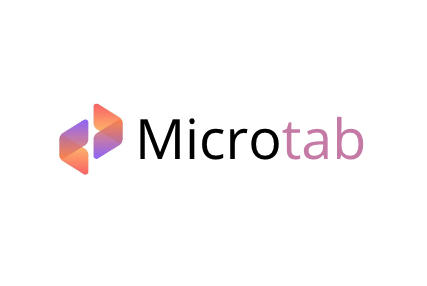
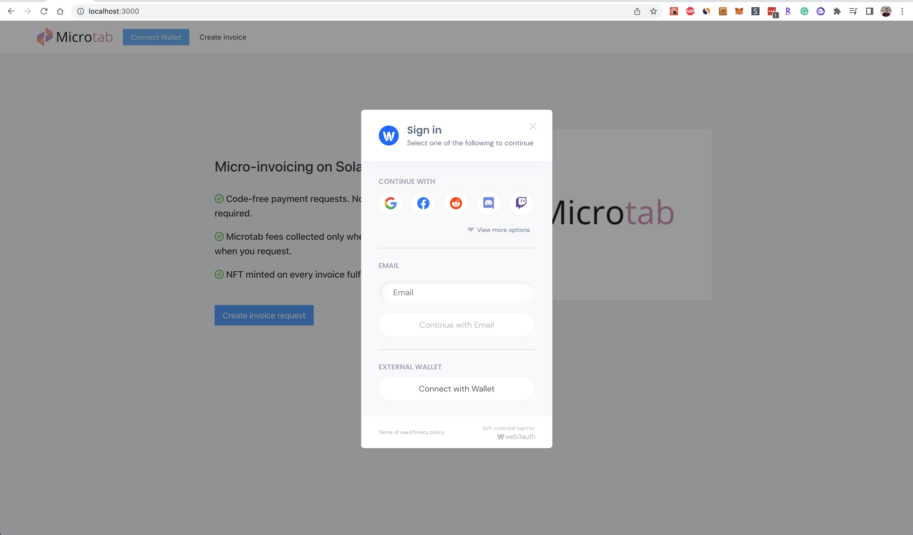
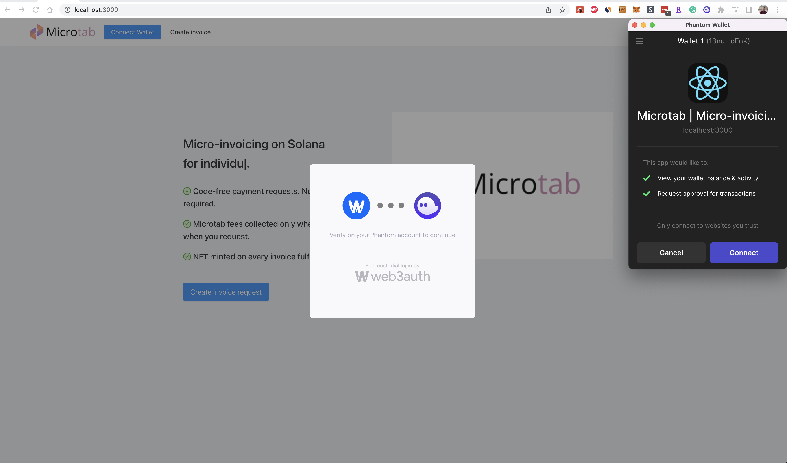
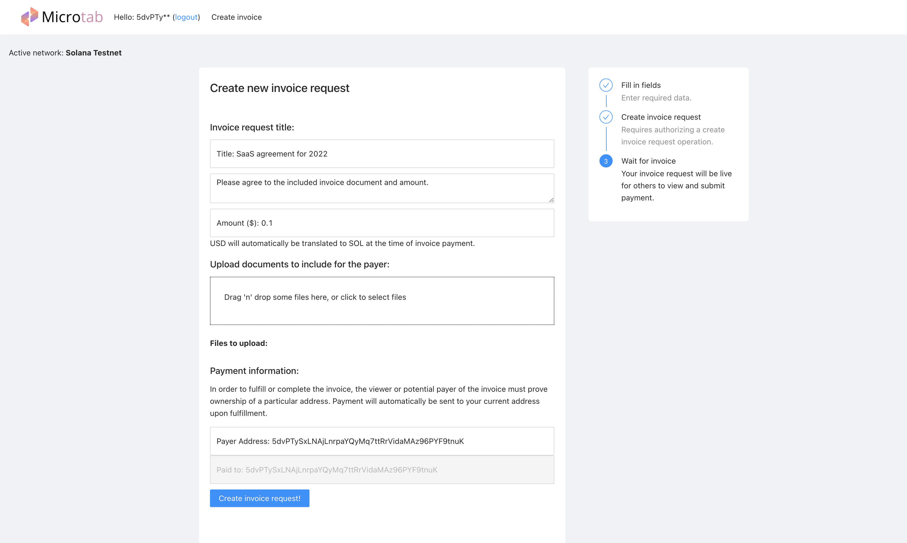
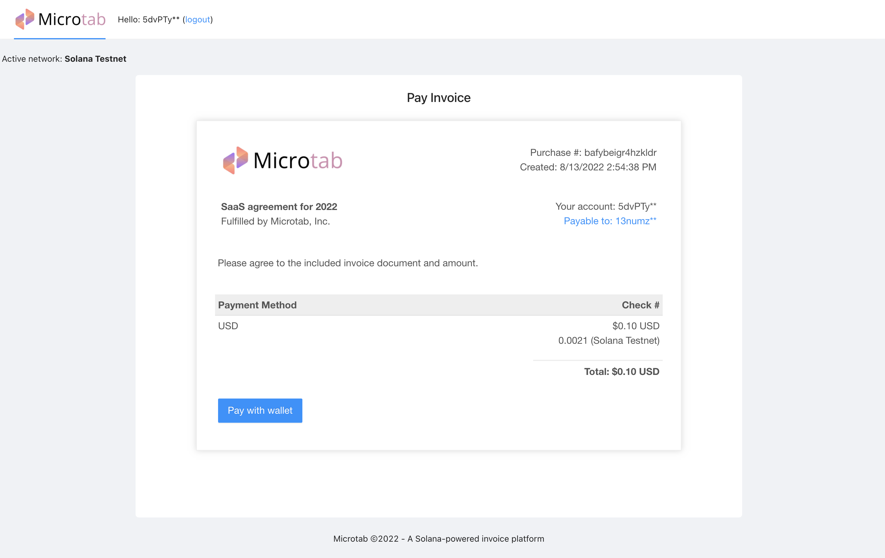
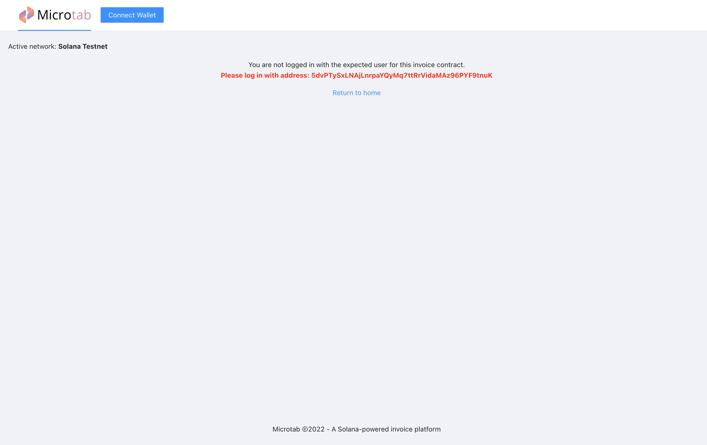
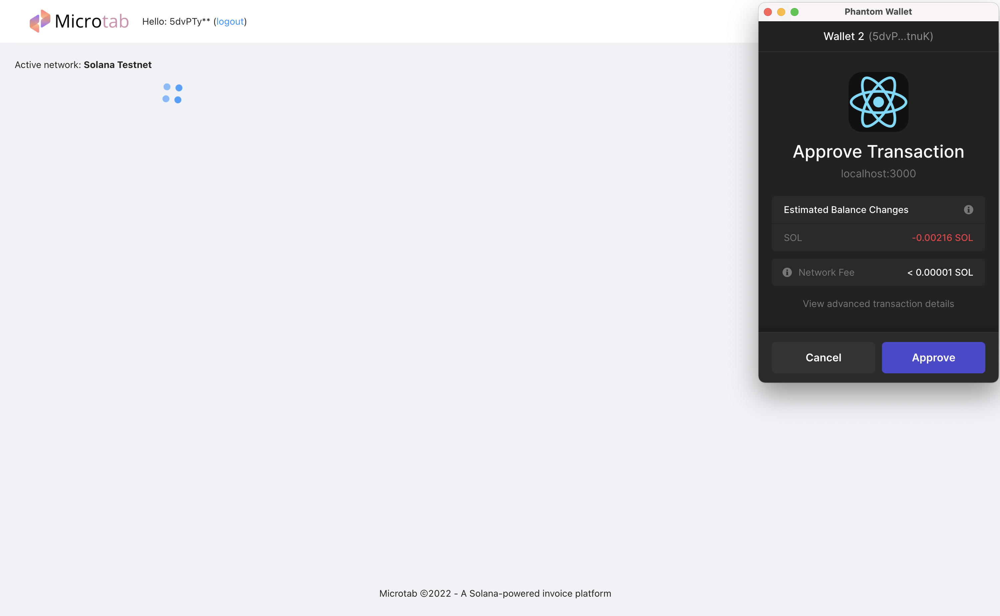
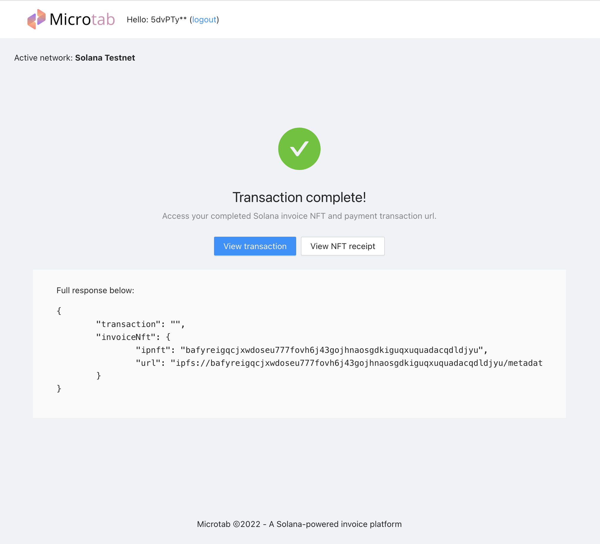
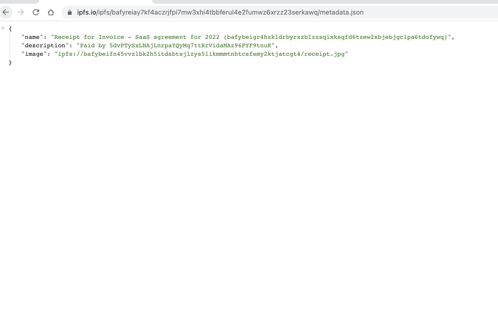
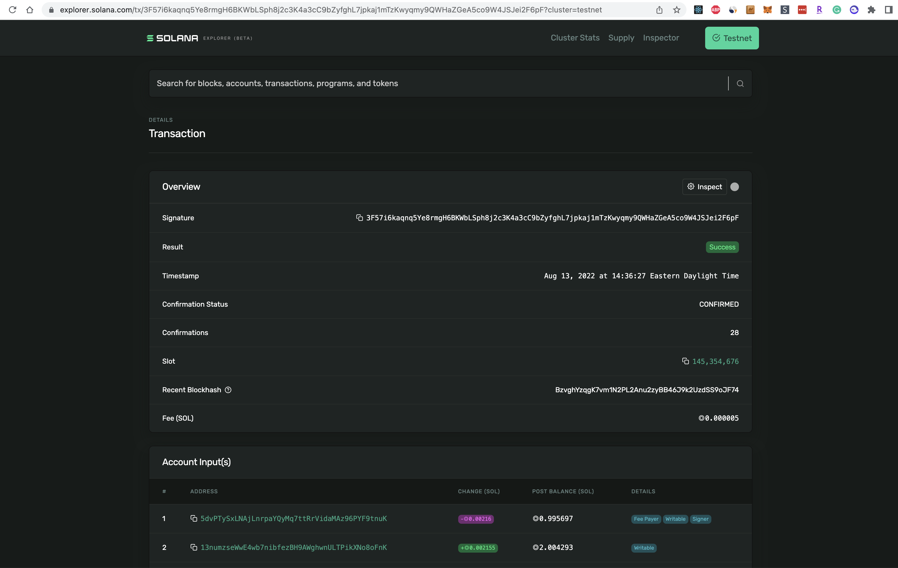

    

Microtab
---

Microtab is a web3 implementation of invoice collection built on Solana and IPFS.

* Free invoice request page hosting on IPFS
* Code-free payment requests. No API integrations required.
* History tracked on blockchain rather than a centralized source.
* Microtab fees collected only when you get paid. Not when you request.
* NFT minted on every invoice fulfillment.
* Uses Solana which enables fast transaction times, low fees, and easy wallet connections.

<b>Going after the payments and web3 tracks for the Solana Summercamp Hackathon 2022.</b>

Try it out <a href="https://microtab.surge.sh" target="_blank">here</a>*

*Zero fees on testnet demo. Requires connecting to Solana testnet.

Demo video: https://youtu.be/sXX8WH8KZE0

### Benefits

- Microtab enables anyone to create and collect invoice against documents without a vendor agreement.
- Each packet of documents for an invoice is made accessible at an IPFS url.
- When the invoice is completed, an NFT is generated that links both the invoice payment to the original request being fulfilled.
- Hosted documents and the request are immutable once deployed. To request again or make a change, simply create a new invoice.
- Fully auditable history tied to Solana blockchain and blockchain explorer rather than centralized systems.

Web2 invoice tech examples: https://www.bill.com/lp/bill-pay https://stripe.com/billing https://quickbooks.intuit.com/accounting/invoicing/

### How it's built

- IPFS: Generation of the invoice record / proof. NFT storage also used for final NFT mint with receipt image.
- Solana: In-app payment of the request and marked completed upon payment of the each request based on receival of desired payers payment.

<!-- <b>This project is a hackathon prototype and would require additional work / deployment to be production ready. -->

### Running the project

To run/demo the project locally, Microtab requires the following environment variables.

<pre>
    REACT_APP_STORAGE_KEY={YOUR_WEB3_STORAGE_KEY} # web3.storage key for file hosting (web3.storage)
    REACT_APP_NFT_KEY={YOUR_NFT_STORAGE_KEY} # (Optional) nft.storage key for receipt nft minting (nft.storage)
</pre>

---

After declaring the above environment variables, use the below command to start the project:
`yarn; yarn start`

Example invoice request:
http://localhost:3000/invoice/bafybeigr4hzkldrbyrxzblzzsqixksqfd6tzew2xbjebjgclpa6tdofywq

By default the project will run against the Solana Testnet and requires a Solana-compatible wallet for signing transactions.

### Screenshots

#### Home page / Login

 

Connecting wallet

#### Creating a invoice request

### Viewing a created invoice url (authorized). 

Each url is dynamically rendered based on assets and data on IPFS

### Created invoice (unauthorized)

### Sending payment

Payment is processed by Solana, offering low fees and quick transaction times. Once payment settles a receipt and transaction url are both provided to the payer.

### Done

### Completed invoice NFT (receipt)

### Completed transaction

### Useful links
* https://web3auth.io/docs/integration-builder?lang=react&chain=sol&customAuthentication=yes&whitelabel=no&dynamicConstructorParams=no&usingEmailPasswordless=no&rnWorkflowMode=expo&evmFramework=web3&customLogin=yes#step-3